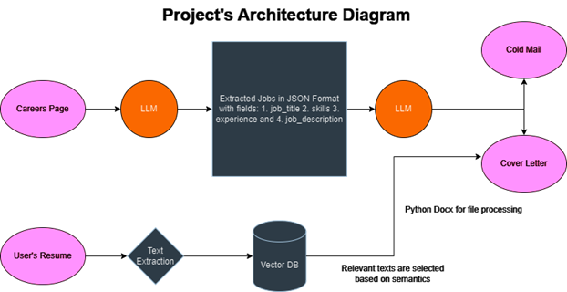
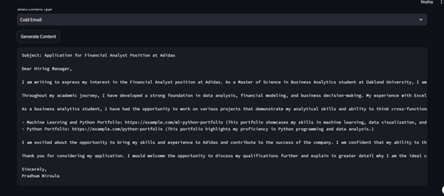
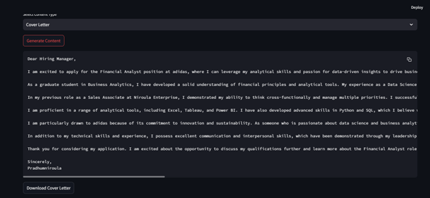

# GenAI-Driven Cover Letter and Cold Email Generator for Job Applications

## 🌟 **Introduction**

In today’s competitive job market, creating personalized, professional cover letters and cold emails for every opportunity can be both time-consuming and inconsistent. Leveraging advanced AI technologies, this project offers a solution to streamline and enhance this effort.

This system combines generative AI, resume relevance analysis, professional document formatting, and a user-friendly interface to simplify the application process. The result? Tailored, high-quality outputs in minimal time.

---

## 🔍 **Problem Statement**

Crafting unique cover letters and cold emails for each job application is repetitive and labor-intensive, especially for job seekers applying to multiple roles across industries. Personalization is key to improving interview chances but often comes at the cost of time and effort.

This project addresses these challenges by automating:

- The creation of personalized documents.
- Resume-to-job relevance analysis.
- Professional formatting and design.

---

## 🎯 **Objectives**

- Automate personalized cover letter and cold email generation.
- Ensure document relevance through resume analysis.
- Simplify the user experience with an intuitive interface.
- Provide polished, professional Word documents.

---

## 🔄 **Flow Chart**

### Fig 1: Project Flowchart

1. **Input:** User uploads a resume and provides a job posting URL.
2. **Processing:**
   - Scrape job descriptions from the URL.
   - Match the resume to job requirements using relevance scoring.
   - Generate tailored documents using LLMs like Llama 3.1 via LangChain.
3. **Output:** Professionally formatted Word documents with:
   - Dynamic content based on job descriptions.
   - Clickable links for contact details.

---

## 🛠️ **System Design and Architecture**

### 1. **Input:**

- Upload a resume.
- Enter a job posting URL.

### 2. **Processing:**

- **Text Extraction:**
  - Resume: Extracted using `python-docx` or `PyPDF2`.
  - Job Description: Scraped and cleaned using LangChain’s `WebBaseLoader`.
- **Relevance Matching:**
  - Resume matched to job requirements using `ChromaDB`.
- **Content Generation:**
  - Structured prompts fed to LLMs to generate personalized documents.

### 3. **Output:**

- Downloadable Word document with:
  - Professionally formatted content.
  - Tailored cover letters and cold emails.

---

## 💻 **Key Technologies**

- **Frontend:** Streamlit for the user interface.
- **Backend:** Python with LangChain and ChromaDB.
- **LLM:** Llama 3.1 via Groq API.
- **File Processing:** `python-docx` for Word generation.
- **Data Cleaning:** Regular expressions for preprocessing.

---

## ✨ **Features**

1. **Dynamic Cover Letter Creation:**

   - Integrates resume details and job descriptions.
   - Includes clickable contact links and professional headers.

2. **Cold Email Generation:**

   - Tailors content to job postings.
   - Highlights user skills effectively.

3. **User-Friendly Interface:**

   - Streamlined input-output process with Streamlit.

4. **Customizable Document Design:**

   - Ensures professional styles with headers, recipient details, and footers.

---

## 🛠️ **Implementation Steps**

1. **Input:** Upload resume and enter job URL.
2. **Text Extraction:**
   - Resume: Processed with `python-docx` or `PyPDF2`.
   - Job Description: Scraped using LangChain’s `WebBaseLoader`.
3. **Relevance Matching:** Content matched to job requirements using `ChromaDB`.
4. **Content Generation:** Prompts structured for LLMs to generate content.
5. **Output:** Documents formatted as `.docx` files.

---

## 📊 **Results**

- **Cover Letters:** Tailored, professional, and time-saving.
- **Cold Emails:** Polished, skill-highlighted, and impactful.
- **Key Feedback:** Clickable links and polished formatting enhance usability.

---

## 📸 **Screenshots**

1. **Streamlit UI:**

   - Input resume and job URL for document generation.
  
    

2. **Cold Email Output:**

   - Professional cold email tailored to job requirements.
  
     

3. **Cover Letter Output:**

   - Ready-to-use cover letter with downloadable options.

     

---

## ⚡ **Challenges**

- Handling diverse resume file formats.
- Ensuring resume-job description relevance.
- Maintaining prompt quality for consistent LLM responses.

---

## ✅ **Conclusion**

The AI-Driven Cover Letter and Cold Email Generator streamlines the application process, delivering high-quality, professional documents with minimal effort. Future enhancements include:

- Expanding file format support.
- Enhancing UI for better user experience.
- Integrating advanced AI models for improved relevance and accuracy.

---

## 💡 **Lessons Learned**

"Start with projects that solve your problem." This simple yet profound advice inspired me to:

- Leave my group project and take on this challenge independently.
- Learn about LLMs and Vector DBs through YouTube tutorials.
- Experiment, debug, and iterate until the project was successful.

Key takeaway: **Work on what drives you.** The drive to solve real-world problems is the biggest motivator for impactful learning and innovation.

---

## 🙏 **Acknowledgements**

1. A special thanks to the creator of the YouTube tutorial "AI Cold Email Generator" for foundational insights.
2. Building on that knowledge, I:
   - Added cover letter generation.
   - Enhanced document design with clickable links.
   - Tailored outputs dynamically for job descriptions and resumes.

---

## 📚 **References**

- Python Libraries: LangChain, Streamlit, python-docx, PyPDF2.
- AI Models: Llama 3.1 by Groq.
- Tutorial: [AI Cold Email Generator on YouTube](https://youtu.be/CO4E_9V6li0?si=PAuaHRUFBV3BsIpK).

